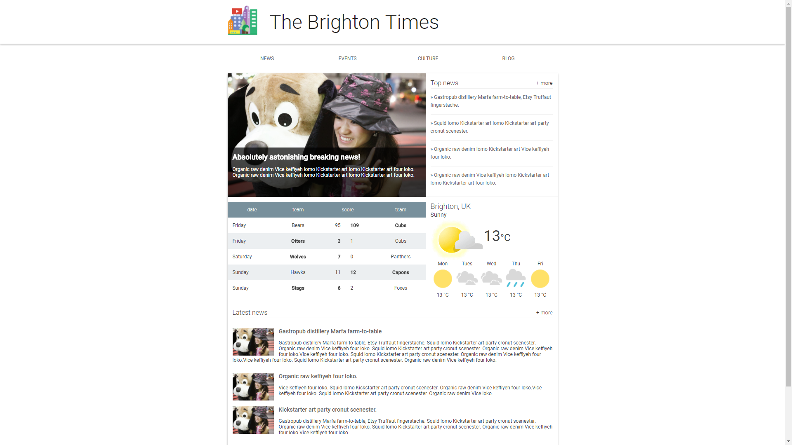

# brighton-times
Make The Brighton Times mock-up responsive
For Udacity FEWD project 

Make the website responsive and use any of the four different common responsive patterns : 
* column drop
* mostly fluid
* layout shifter
* off canvas

Use media queries for minor and major breakpoints. Start small and build up!

Here is the original mockup screenshot:
 

